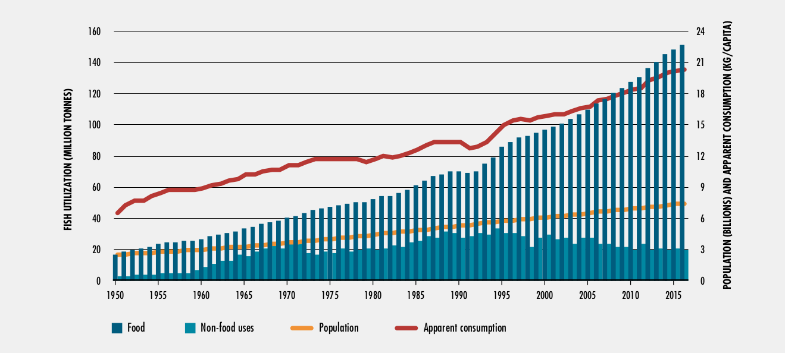
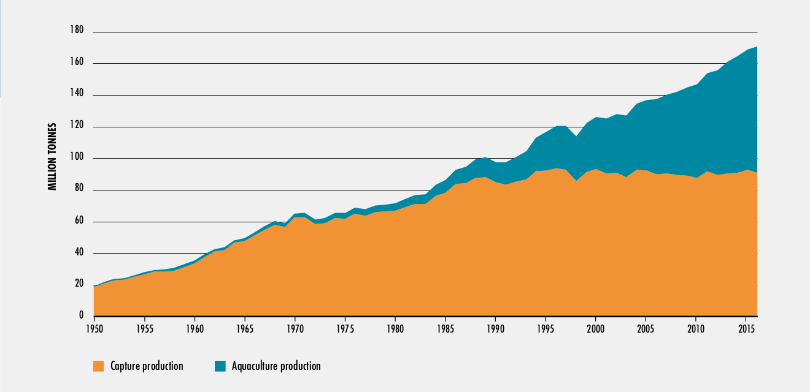
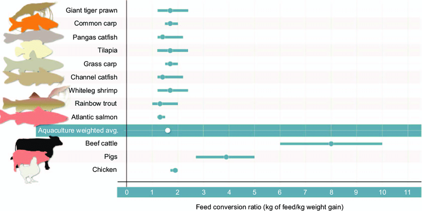
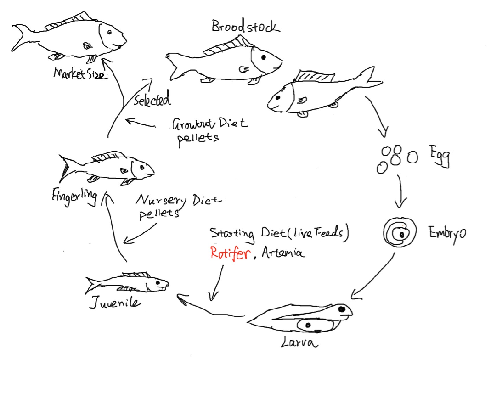
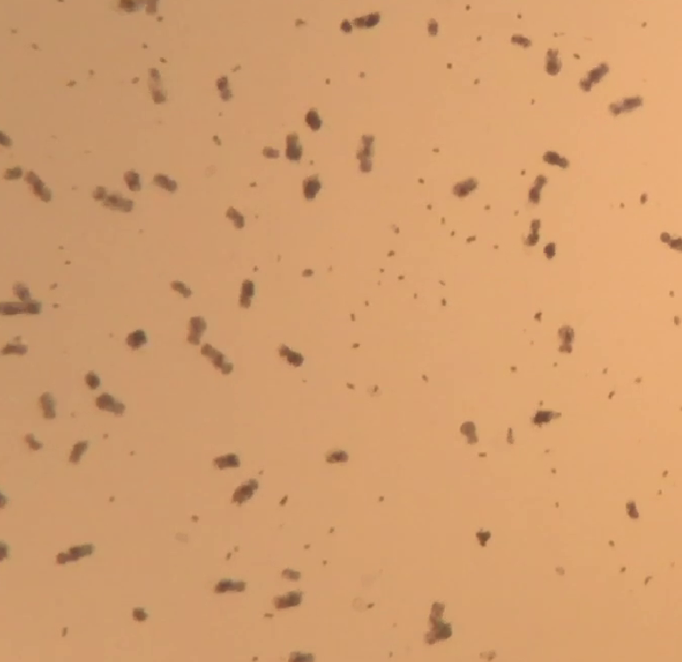
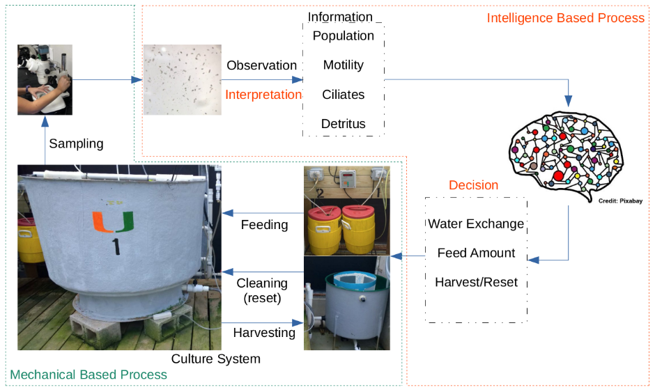

 
[[_back to directory_]](index.md)

# A.I. FOR ROTIFER CULTURE - PROJECT BACKGROUND

## PROTEIN FROM THE OCEANS

 
_"We’ll need to farm the seas to survive in a crowded world. But the challenge will be to do it right."_ 

_- Bryan Walsh_

With the growing of the population and the appetite for protein from the sea, the oceans are under pressure more than
ever. The current world fish consumption is more than twice as much as it was 50 years ago ([Fig. 1](#fig1)). We
urgently need to find a sustainable way to harvest protein from the oceans.

<a name='fig1'> 

Figure 1. World Fish Utilization and Apparent Consumption ([FAO 2018](#ref1))

 

 

According to The State of World Fisheries and Aquaculture (SOFIA) 2018 by the Food and Agriculture Organization
, aquaculture contributed 53% of global food-use fish production and it is expected to be responsible for the
continuing impressive growth in the supply of fish for human consumption as the capture fishery production
relatively static since the late 1980s ([Fig. 2](#fig2)). 

<a name='fig2'>

Figure 2. World Capture Fisheries and Aquaculture Production ([FAO 2018](#ref1))

 

 

## AQUACULTURE 101

<a name='fig3'>

 Figure 3. Comparison of Feed Conversion Ratio ([Fry et al. 2018](#ref2))

 

Aquaculture is an efficient way of producing protein as it has lower Feed Coversion Ratio (FCR, Feed Given/Animal
Weight Gain) compare to other livestock such as beef cattle, pigs and chickens ([Fig. 3](#fig3)). Fish farmers raise
fish from eggs to market size ([Fig. 4](#fig4)). In the fish's "life cycle", the feeds is the most important
element. Fish at different stages requires suitable feeds of different sizes and nutritional profiles. __Rotifers
, also called wheel animals, are the mostly commonly used starting diet for fish larvae.__

<a name='fig4'>

Figure 4. "Life Cycle" of Fish in Aquaculture

 

 

## ROTIFER - TINY BUT SIGNIFICANT 

Fish larvae at early stage can only feed on small particles (< 200 um). Rotifers ([Fig. 5](#fig5)), _Brachionus spp._
, are crucial starting diet for fish aquaculture because of their suitable size (50~150 um), adequate nutrition
profile when properly enriched, and their bio-encapsulation ability. 
Fish larval production usually requires a continuous supply of live rotifers in large quantities. 
For example, producing 1000 40 Day-Post-Hatch (DPH) American red snapper fingerlings will need a supply of at least
500 millions rotifers. In commercial scale fish farm, each production cycle could require supplies of billions of
 rotifers as live feed. __Before raising fish, fish farmers must raise the rotifers.__ 

<a name='fig5'> 

Figure 5. Rotifer Sample Under Microscope

 

 

Most of the work in rotifer cultivation need to be mannually operated. The rotifer culture and maintenance is labor
intensive and requires significant input from experienced live feed culurists. __The lack of skilled live feed
technicians and cost efficient labors is one of the barriers to develop aquaculture in developed countries and regions
. Automation is an inevitable path for the future of aquaculture.__ 

## HOW CAN A.I. HELP

[Fig. 6](#fig6) shows the high level rotifer culture process. 
In practice, live feed culturist observe the rotifer samples under the microscope, __evaluate the "dirtiness" of the
culture, and count the rotifers (egg carrying rotifers - ECR and non-egg carrying rotifers - NECR)__. 
Then the estimated rotifer density and fertilization rate will be used for deciding the feed amount according to the
feeding formula (usually consists of algea, yeast, etc.). 
Critically, if the rotifer culture is too "dirty" (lots of detritus or ciliates), the whole rotifer culture need to be
thoroughly cleaned (by washing and filtering) and reset.
 
<a name='fig6'> 

Figure 6. Rotifer Culture Process

 

 

To develop automated rotifer culture system, the most important thing is to develop the "brain", a mechanism to
interpret the information that is directly related to the rotifer culture operational decisions. 
In short, the two key factors are:
- Population Information 
- Culture Contamination Level

__Hence, the main objective of this project is to develop an A.I. agent that can intepret the microscopic images of
 rotifer samples. More specifically, the agent is expected able to:__
 - __Identify, classify (into ECR, NECR) and count rotifers__
 - __Evaluate the contamination level of rotifer culture__

## References

<a name='ref1'> 

[1] FAO (Ed.). (2018). _The state of world fisheries and aquaculture: Meeting the sustainable
 development goals._ Rome.

<a name='ref2'> 

[2] Fry, J. P., Mailloux, N. A., Love, D. C., Milli, M. C., & Cao, L. (2018). Feed conversion
 efficiency in aquaculture: do we measure it correctly?. _Environmental Research Letters_, 13(2), 024017. 
 
  
  

 
 --------------------------------------------
 _Author: Jia Geng_
 
 _Last Update: 12/13/2019_
 
 [[_go back to top_]](#top)