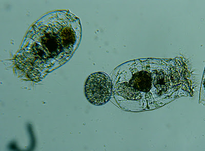
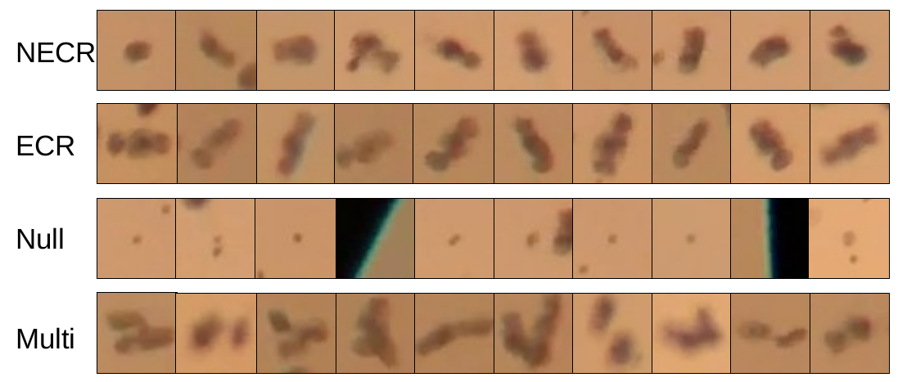

 
[[_back to directory_]](index.md)

# THE ROTIFER AND THE ROTIFER DATASET

## Why Care About How Rotifers Look?

The feeds for rotifer cultivation usually consist of high protein and lipid contents,
which are essential for fish larval development.
Appropriate feeding rate is important for rotifer culture as well as the health of fish larvae.
Underfeeding could lead to insufficient capsulation of nutrients or even declined rotifer population.
Overfeeding could lead to deteriorated water quality and the development of pathogenic bacteria, 
which are detrimental for rotifers as well as the fish larvae.

Rotifers have a short lifespan (7-10 days) but can reproduce every 4-8 hours. 
Hence, the rotifer population, especially in commercial scale culture, is highly dynamic.
The feeding rate must be decided by not only the current population but also the fertilization rate.
For fish farmers, one of the most important know-how is to be able to recognize 
the fertilized rotifer and un-fertilized rotifer ([Fig. 1](#fig1)). 

Egg-carrying (fertilized) rotifer and non-egg-carrying (unfertilized) rotifer can be easily recognized with human eyes.
However, it becomes tedious and inefficient when hundreds of rotifers under the microscope need to be recognized and
 counted.
For commercial scale fish farm where many batches of rotifer culture are maintained at the same time, 
a live feed specialist could spend hours just in counting the rotifer samples. 

<a id='fig1'>

Figure 1. Egg Carrying Rotifer (top-left) and Non-egg Carrying Rotifer (right).

 

_(Photo by AmandaCox via [Marine Breeding Initiative](http://www.mbisite.org/))_

Another important evaluation on the rotifer culture is the "dirtiness".
The "dirtiness" is reflected by the presents of the detritus and ciliates in the rotifer samples 
and is assessed based on live feed specialists' observation and experience. 
When a live feed specialist determine the rotifer culture is "too dirty", a reset (like dialysis) process will be executed. 
The whole rotifer culture will be washed through a mesh 
that can retain the rotifers but let the smaller detritus and ciliates pass through. 
A reset can purify the rotifer culture but it could also wash away the rotifer eggs, 
which will compromise the population growth.

To learn more about rotifer culture, please refer to  [Manual on the Production and Use of Live Food for Aquaculture](http://www.fao.org/3/W3732E/w3732e0c.htm#3.%20ROTIFERS)
([Baert et. al 1996](#ref1)).

## The Rotifer Dataset for Developing A.I. Models

Dataset is the foundation to build an A.I. system. 
At the University of Miami Experimental Hatchery (UMEH), rotifer culture is maintained 
at large quantities year round to support fingerling production for the ongoing research projects.
The live feed specialists at the UMEH keep track of the daily rotifer management records, 
which includes 
the culture state records (rotifer density, fertilization rate, and contamination level) 
and the operational records (feeding ratio, water exchange ratio, and reset decision).

This project was initiated in August 2020. 
Since then, we have been collecting the microscopic imagery data of the rotifer samples. 
So far, we have collected more than 50 video clips (45,000 frames) 
of the rotifer sample (0.1 ml) under the microscope (10x).
Each video is annotated with the daily records.
Besides, we have labeled more than 12,500 objects proposals made by the background subtraction algorithm. 
The proposals were annotated (ECR, NECR, Multi, Null) by the live feed specialists at the UMEH 
([Fig. 2](#fig2)). 

<a id='fig2'>

Figure 2. A Random Sample of Labeled Objects. 

_NECR: non-egg carrying rotifer; ECR: egg-carrying rotifer; Null: Negative Detection; Multi: Multiple Rotifers_

We will continue collecting the data. We expect to have over 100 video clips (90,000 frames) 
and about 50,000 labeled objects by May 2020.

## References

<a id='ref1'> 

[1] Baert, P. & Bosteels, T. & Sorgeloos, Patrick. (1996). 
Manual on the Production and Use of Live Food for Aquaculture. Pond production. 196-251.  

 --------------------------------------------
 _Author: Jia Geng_
 
 _Last Update: 01/04/2019_
 
 [[_go back to top_]](#top)