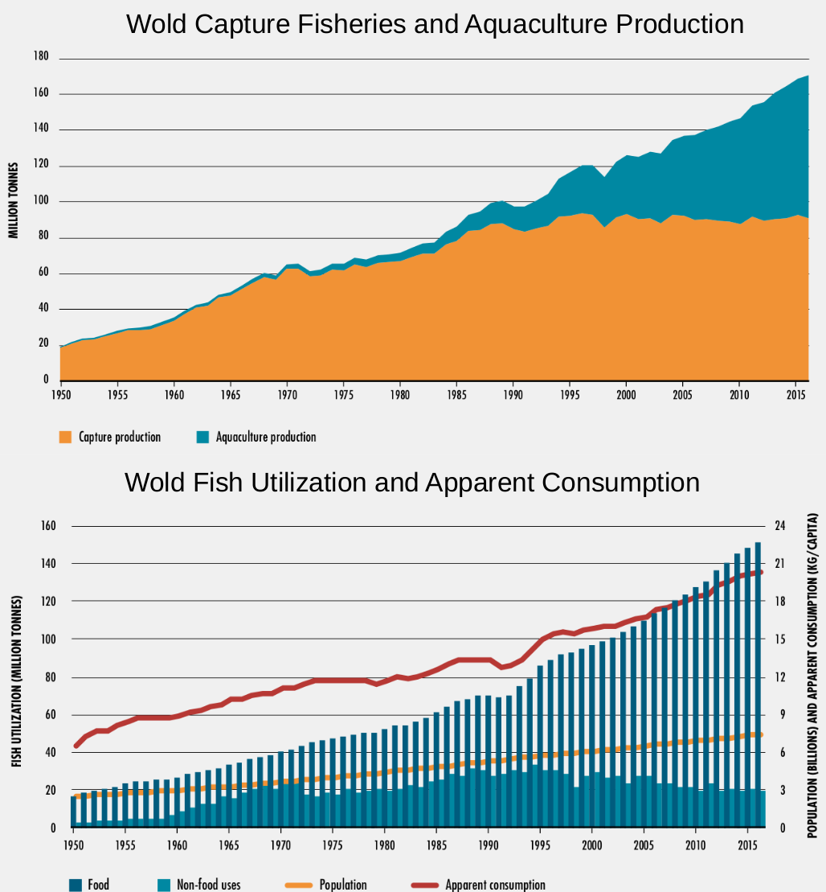

# PROTEIN FROM THE OCEANS

 
_"We’ll need to farm the seas to survive in a crowded world. But the challenge will be to do it right."_ 

_- Bryan Walsh_

 

With the growing of the population and the appetite for protein from the sea, the oceans are under pressure more than
ever. The current world fish consumption is more than twice as much as it was 50 years ago. We urgently need to find a
sustainable way to harvest protein from the oceans.

 

According to The State of World Fisheries and Aquaculture (SOFIA) 2018 by the Food and Agriculture Organization
, aquaculture contributed 53% of global food-use fish production and it is expected to be responsible for the
continuing impressive growth in the supply of fish for human consumption as the capture fishery production
relatively static since the late 1980s. 

% of seafood imported by United States. CO2 footprint, untrackable biosecurtiy.

# AQUACULTURE 101

# ROTIFER - TINY BUT SIGNIFICANT

