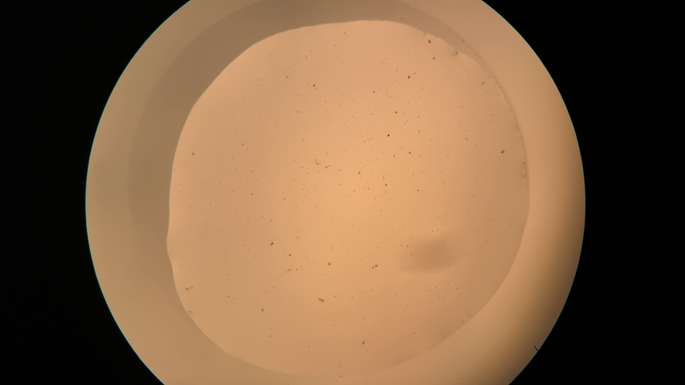
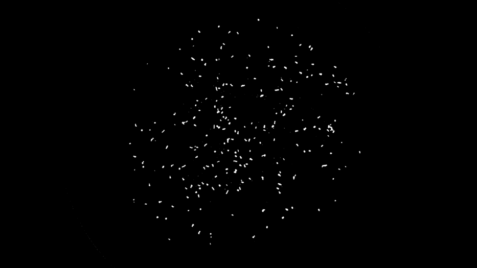

 
[[_back to directory_]](index.md)

# MOVING OBJECT DETECTION 

## Background Subtraction - A Simple but Powerful Tool

Background subtraction algorithm (in general) detect moving (foreground) object(s) by 
subtracting the image frame by a background model.
It is widely used in video-surveillance applications
, since they need to detect, track and count persons, vehicles, animals, etc. 
Background subtraction is also well suited for detecting moving creatures under the microscope.

The background subtraction algorithm assumes that pixels belong to the background 
for the most of the time. 
This is an appropriate assumption when the goal is to detect the moving object(s).
If we can construct a model to describe the background, 
the foreground (image frame - background) would contain the object(s) of interest.

There are different techniques to construct and/or maintain the background model such as
frame differencing, running average of frames, per pixel Gaussian mixture model, etc.

For this project, since the microscopic images usually do not suffer from 
strong illumination variance, shadow or dynamic background, 
we adopt the simple median-based background subtraction. 
Although median could be expensive to compute, the trials showed that we could construct 
high quality background using only 10 image frames or even less.

[Fig. 1](#fig1) shows the background constructed from the median of 10 frames. 
[Fig. 2](#fig2) shows the foreground detection.

<a id='fig1'>

Figure 1. Median of 10 image frames.

<a id='fig2'>

Figure 2. Foreground Detection using Median-based Background Model

## Foreground Analysis

_post soon..._

 --------------------------------------------
 _Author: Jia Geng_
 
 _Last Update: 01/06/2019_
 
 [[_go back to top_]](#top)
